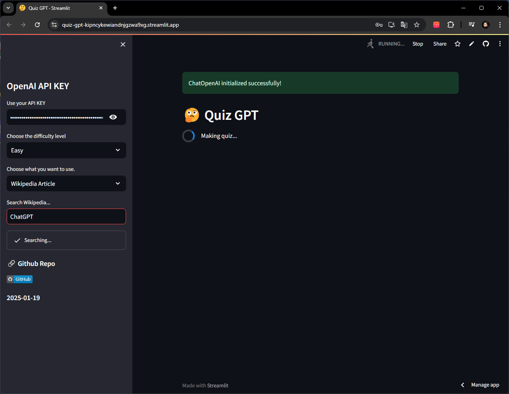
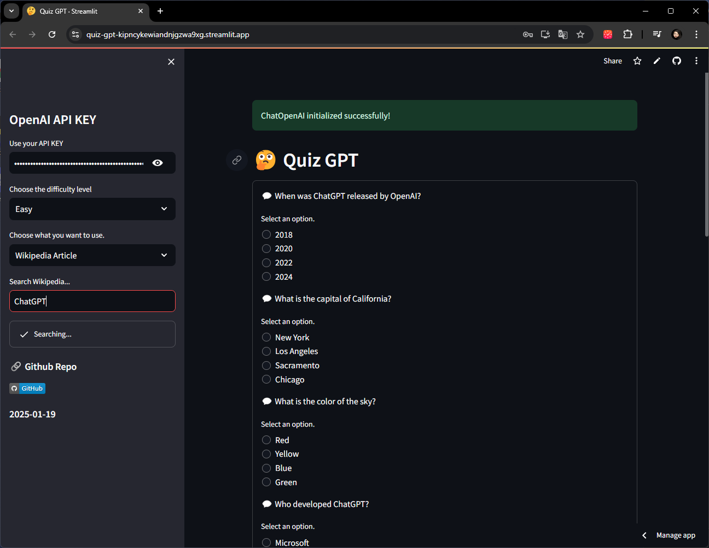
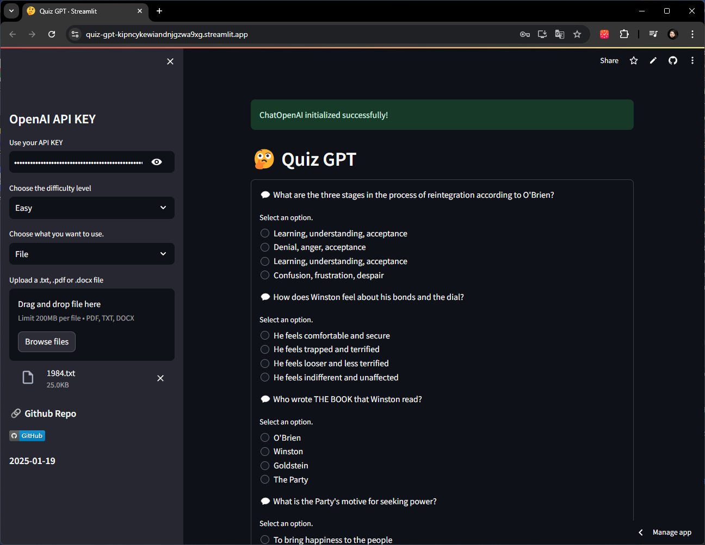
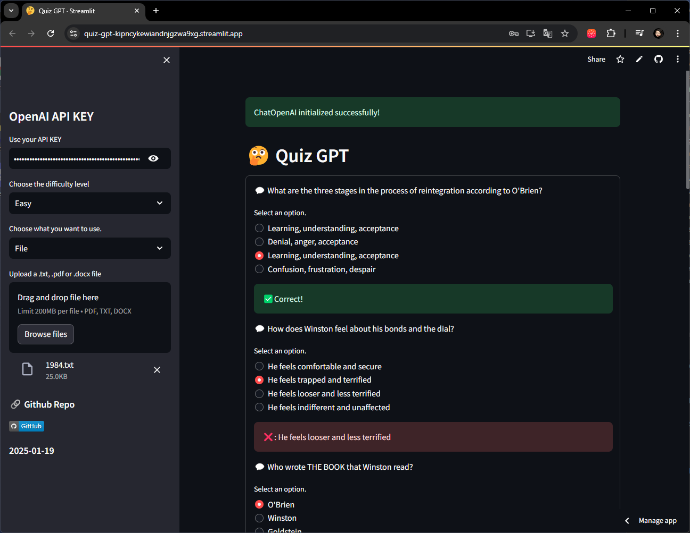
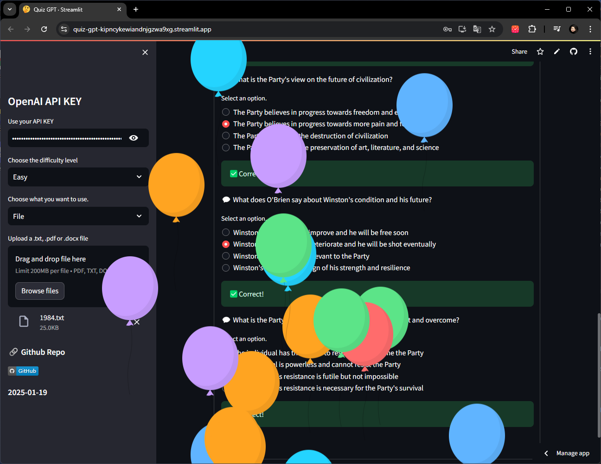

# QuizGPT Turbo

### Date: 2025-01-19

**Nomad Coders - FullstackGPT #9.0 ~ 9.9**

## ⚒️ Task
1. [x] Users can upload a file or search Wikipedia as the quiz resource.
2. [x] make a quiz
3. [x] use caching
4. [x] Use Function calling
5. [x] Allow the user to customize the difficulty of the test
6. [x] make the LLM generate hard or easy question
7. [x] Allow the user to retake the test if not all answers are correct
8. [x] If all answers are correct use st.balloons
9. [x] Allow the user to use its own OpenAI API Key - st.input inside st.sidebar
10. [x] Using st.sidebar put a link to the Github repo with the code of your Streamlit app

## 📸 Screenshots

